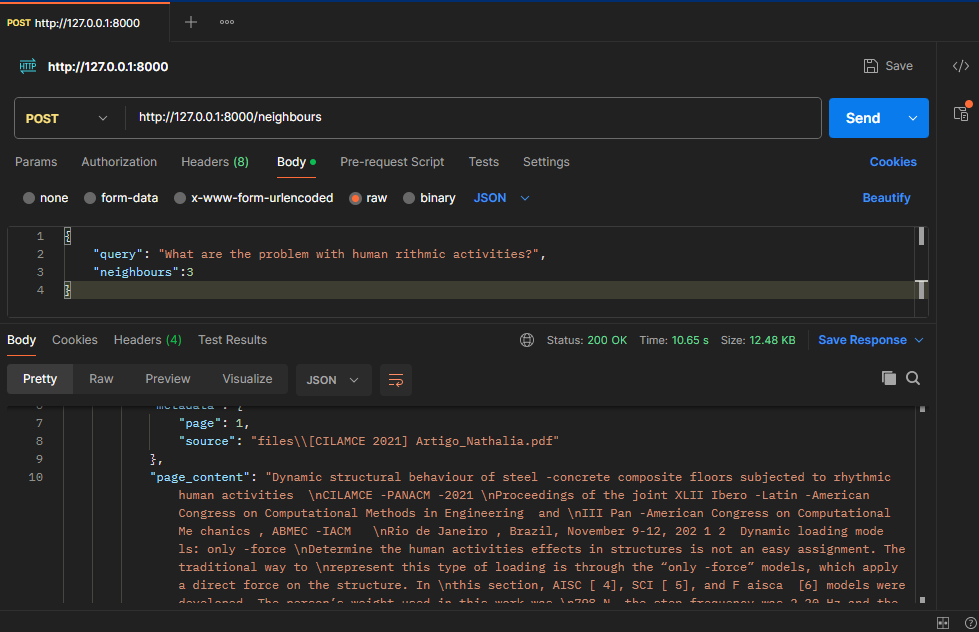

# Vector Database with FastAPI

The aim of this project is to develop an API to create a vector database using ChromaDB with FastAPI. 

For testing, I use one of my papers, which can be found at ```/files```.

## Structure

There are two functions in ```functions.py```, that are responsible to create and delete database. 

The steps to **create the vector database** are:
1. Load the documents that I want to persist in the vector database
2. Create chunks using a text splitter from Langchain
3. Load an embedding function to create embeddings from the chunks. In this project, I use a open-souce model "all-MiniLM0L6-v2" which is avaiable at [sbert.net](https://sbert.net/).
4. Persist documents in ChromaDB

The step to **delete the vector database** is delete the related folder.

### API Creation

It was defined three methods:

1. Create database, using GET.
2. Delete database, using DELETE. 
3. Querying database, using POST.

#### Querying database

For POST method, it was defined a simple data validation using pydantic which can be found at ```models.py```. In this file, a class is created to guarantee data types. For query is _str_ and for number of neighbours is _int_. 

